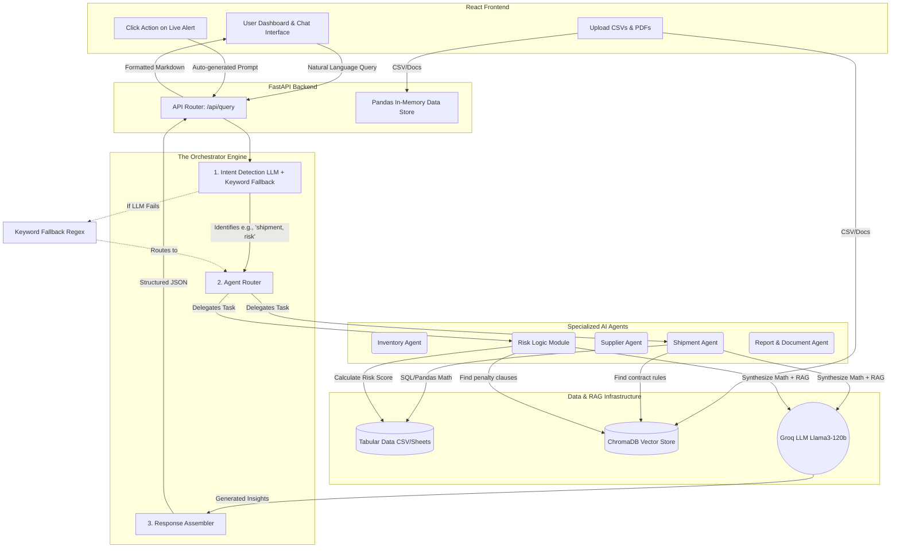

# Agentic AI Supply Chain Control Tower: System Architecture

This document breaks down the current architecture of the AI Supply Chain Control Tower. It is designed to be easily digestible for a classroom presentation while covering the technical depth of the agentic workflows, RAG integration, and edge-case handling.

---

## High-Level Workflow Diagram

The system follows a clear pipeline: **Input → Intent Detection → Agent Routing → Data & RAG Retrieval → LLM Synthesis → Output**.

---

## Step-by-Step Architecture Breakdown

### 1. The Entry Point (Frontend to API)

The adventure begins when a user submits a query (e.g., _"What happens if SHP007 is delayed?"_) or clicks the "Action" button on a Live Alert.

- **Design Decision:** The frontend is entirely "dumb." It does not know how to solve the problem. It simply packages the text and fires an HTTP POST to the FastAPI backend (`/api/query`).

### 2. The Brain: The Orchestrator (`engine.py`)

Instead of sending the query blindly to an LLM like ChatGPT, the query hits the **Orchestrator**. This is the manager of the AI team.

- **Step 2a: Intent Detection (`intent.py`)**
  - The orchestrator asks the Groq LLM a hidden question: _"Classify this user query into these categories: Inventory, Supplier, Shipment, Report, Risk."_
  - **Edge Case Handled:** What if the Groq API times out or crashes during this step? The system instantly catches the error and falls back to a hardcoded Regex Keyword list. If it sees the word "delayed", it knows it needs the Shipment Agent.
- **Step 2b: Routing (`router.py`)**
  - Based on the detected intent (e.g., `["shipment", "risk"]`), the Orchestrator instantiates those specific Python classes.

### 3. The Workers: Specialized Agents (`agents/`)

This is where the true "Agentic" nature of the application shines. Standard LLMs are terrible at math and hallucinations. We fix this by giving agents strict rules.

When an agent (e.g., `ShipmentAgent`) wakes up, it follows a strict 3-phase execution:

1.  **Hard Math (Deterministic Data):** The agent writes Python Pandas code to look up `SHP007` in the loaded CSV data. It calculates exactly how many days late it is. _LLMs are not allowed to do math; Python does the math._
2.  **RAG Retrieval (Context):** The agent searches the **ChromaDB Vector Database** for any uploaded Word documents or PDFs that mention "delays" or "SHP007" to find qualitative context (like penalty clauses).
3.  **Synthesis (The LLM Call):** Finally, the agent takes the exact Pandas math and the exact RAG document text and sends it to the Groq LLM with a prompt: _"You are a shipment expert. Answer the user's question using ONLY this provided math and these document snippets."_
    - **Edge Case Handled:** If a user asks about `SHP007`, the agent uses regex to filter the Pandas dataframe to _only_ show `SHP007` to the LLM. This prevents the LLM from getting confused and hallucinating about other delayed shipments.

### 4. The Guardrails: Assembly & Verification

Multiple agents might have been called. For example, `ShipmentAgent` analyzed the delay, and `RiskLogicModule` analyzed the cascade effect on manufacturing.

- **Assembly:** The Orchestrator collects the responses from all agents and stitches them together.
- **Deduplication:** If both agents give the exact same recommendation, the system filters out the duplicates to keep the final report clean.
- **Fallback:** If an agent completely crashes during step 3, the Orchestrator catches the error gracefully and returns a partial response with a warning banner, instead of crashing the entire application (Graceful Degradation).

### 5. Final Output

The structured JSON is passed back to the React UI, which uses a custom Markdown parser (`utils/markdown.jsx`) to render beautiful tables, bold headers, and bullet points for the user to read.

---

## Key Concepts for the Classroom

1.  **AI Agents vs. LLMs:** An LLM generates text. An AI Agent connects an LLM to tools (like Pandas for math and ChromaDB for document search) so it can interact with the real world without hallucinating.
2.  **RAG (Retrieval-Augmented Generation):** The AI doesn't know your specific company policies. We convert your PDFs into mathematical vectors (embeddings) and store them in ChromaDB. When an agent has a question, it mathematically searches for the most relevant paragraph and gives it to the LLM alongside the prompt.
3.  **Multi-Agent Orchestration:** Complex supply chain problems require multiple perspectives. By breaking the AI down into specific "experts" (Inventory, Risk, Supplier) and having a Manager (Orchestrator) coordinate them, we achieve vastly higher accuracy than a massive single AI prompt.

---

## Deep Dive: Real-World Scenarios & Edge Cases

To fully grasp the architecture, let's explore three detailed scenarios demonstrating how the system navigates complex supply chain requests and recovers from unexpected edge cases.

### Scenario 1: The "Lazy" Query (Intent Fallback Edge Case)

**User Query:** _"Fix the late stuff."_

**The Flow:**

1. **Input:** The query is sent to the Router (`/api/query`).
2. **Intent LLM Fails/Struggles:** The Groq LLM might be confused by the vagueness of "stuff" and fail to return a proper JSON classification, or the Groq API might momentarily time out.
3. **Keyword Fallback (Edge Case Triggered):** The `intent.py` script catches the failure. It scans the string against its hardcoded dictionary. It matches "late" to the **Shipment Agent** keyword list.
4. **Execution:** The Orchestrator safely routes the query to the `ShipmentAgent`.
5. **Data Filter:** Since the user didn't specify a Shipment ID, the agent queries the entire `shipments.csv` DataFrame, calculates the average delay, and lists the top delayed shipments.

### Scenario 2: The Needle in the Haystack (RAG Edge Case)

**User Query:** _"Supplier SUP005 is requesting a price increase. Are we allowed to reject it?"_

**The Flow:**

1. **Intent:** Orchestrator routes explicitly to the **Supplier Agent**.
2. **Hard Data:** The agent finds `SUP005` in `suppliers.csv`, noting their Risk Score is 0.55 and On-Time Rate is 65%.
3. **RAG Retrieval:** The agent queries ChromaDB looking for "price increase" and "SUP005".
4. **Empty Context (Edge Case Triggered):** ChromaDB returns _nothing_. The user forgot to upload the Master Service Agreement for SUP005.
5. **Synthesis Guardrail:** The prompt to the Groq LLM includes a strict rule: _"If you do not have document context, say so. Do not invent rules."_
6. **Output:** The AI replies: _"SUP005 has a low reliability score of 65%. However, regarding cost increases, **I cannot find any uploaded contracts in the system**. Please upload the supplier agreement to verify our right to reject."_ (Preventing a hallucinated legal answer).

### Scenario 3: The Multi-Agent Cascade (Complex Routing)

**User Query:** _"Shipment SHP007 is delayed. We are going to run out of stock. Who makes this item?"_

**The Flow:**

1. **Intent:** The LLM perfectly detects three distinct intents: `["shipment", "inventory", "supplier"]`.
2. **Sequential Routing:** The Orchestrator wakes up all three agents.
3. **Agent 1 (Shipment):** Analyzes `SHP007` and confirms a 12-day delay from São Paulo.
4. **Agent 2 (Inventory):** Cross-references `SHP007`'s payload (SKU-007) and calculates that Safety Stock hits 0 in 2 days. Triggers a "Critical Pipeline Risk" flag.
5. **Agent 3 (Supplier):** Looks up the manufacturer of SKU-007 (LatAmCargo / Supplier ABC).
6. **Assembler Collision (Edge Case Triggered):** All three agents submit their reports to the Orchestrator. The Orchestrator's `engine.py` runs a deduplication script. If the `ShipmentAgent` and `InventoryAgent` both say "SKU-007 is at risk", the Orchestrator merges these sentences to prevent the user from reading the exact same warning twice.
7. **Output Formation:** The backend returns a beautiful, unified 3-part Markdown report with zero redundant information.

---

## The Agents: In-Depth Deep Dive

### 1. Inventory Agent

**Purpose:** Monitors stock levels, calculates burn rates, and predicts stockouts.
**How it Works:** It reads `inventory.csv` and `demand.csv`. It calculates "Days of Cover" by dividing On-Hand stock by Average Daily Demand.
**Example:** If you ask _"Which items need reordering?"_, the agent doesn't guess. It does the math, finds SKU-005 has 0 stock, and outputs: _"SKU-005 is at critical risk. Order immediately."_

### 2. Supplier Agent

**Purpose:** Evaluates supplier reliability and tracks performance metrics.
**How it Works:** It analyzes `suppliers.csv`, calculating average delay days and defect rates to generate an "Instability Score."
**Example:** If you ask _"Is Supplier SUP008 reliable?"_, it checks the data, sees an On-Time Rate of 60%, searches RAG for SUP008 contracts, and replies: _"SUP008 is highly unstable (60% on-time). Consider shifting volume to secondary suppliers."_

### 3. Shipment Agent

**Purpose:** Tracks moving freight and predicts arrival delays.
**How it Works:** It scans `shipments.csv`, filtering by status (e.g., "delayed", "in*transit"). It can filter the dataset strictly to a single Shipment ID if requested.
**Example:** If you click an alert for "SHP007 Delayed", it isolates SHP007 data, sees it is 12 days late from São Paulo, and says: *"SHP007 is critically delayed. Reroute via Air Freight immediately."\_

### 4. Report Agent (Document Context)

**Purpose:** Specialized in querying unstructured RAG data (PDFs, text files).
**How it Works:** Instead of heavy Pandas math, it relies entirely on ChromaDB to find qualitative answers about policies, compliance, and contracts.
**Example:** If you ask _"What is our policy on late shipments?"_, it bypasses CSVs entirely, queries the vector database for "late shipment policy", and returns the exact clause extracted from `document.txt`.

---

## The Risk Logic Module: Deep Dive

**Purpose:** The Risk Module is the "big picture" synthesizer. While other agents look at isolated events (a late truck or a low bin), the Risk Module connects the dots to calculate catastrophic, cascading failures.

**How it Works:**

1. It ingests all data simultaneously (Inventory, Shipments, Suppliers, Demand).
2. It runs a proprietary mathematical algorithm: `Risk Score = (Supplier Instability) + (Inventory Depletion Risk) + (Shipment Delay Impact)`.
3. It ranks the entire supply chain by vulnerability.

**Example:** The Shipment Agent knows `SHP007` is late. The Inventory Agent knows `SKU-007` is low. The **Risk Module** connects them: _"Because SHP007 is late, SKU-007 will hit zero on Wednesday, which will halt manufacturing line B."_ It provides a multi-variable threat assessment.

---

## The UI Confidence Score (%)

**What is it?** Next to the AI's response in the Chat UI, you will see a badge (e.g., `92% confidence`).

**Why does it exist?** LLMs act like "black boxes." In enterprise software, making a million-dollar rerouting decision based on AI requires immense trust.

**How is it calculated in this project?**
The score is dynamically calculated by the Orchestrator (`engine.py`) based on several factors:

1. **Data Availability:** Did the AI have actual CSV rows to look at? (Score increases).
2. **RAG Context Hits:** Did ChromaDB successfully find relevant contract clauses? (Score increases).
3. **Agent Consensus:** Did multiple agents agree on the severity of the alert? (Score increases).
4. **Verification Module:** The backend specifically runs `verification.py` to double-check the LLM's response against the raw context. If the AI hallucinated a fact not found in the documents, the score drops drastically.

5. **The Value:** By exposing this metric in the UI, the Control Tower ensures end-users treat the AI as a highly capable assistant rather than a flawless oracle, prompting human review when confidence is low.

---

## Advanced Technical Concepts (Under the Hood)

For a senior-level technical dive, here are the core engineering decisions driving the backend architecture:

### 1. In-Memory Pandas DataStore vs. Traditional SQL Databases

- **The Decision:** Instead of a live Postgres or MySQL database, `data/store.py` loads CSV files directly into Pandas DataFrames stored in RAM.
- **The "Why":** Supply chain analysis requires "analytical math" (aggregating averages, filtering giant lists of SKUs, calculating matrices). Pandas uses highly optimized, C-compiled vectorized operations that perform these complex calculations instantly in memory, something a standard SQL CRUD database struggles with without heavy indexing. It prioritizes analytical speed over transactional persistence.

### 2. High-Dimensional Vector Embeddings (ChromaDB)

- **The Decision:** RAG (Retrieval-Augmented Generation) uses ChromaDB instead of a standard search engine like Elasticsearch.
- **The "Why":** Standard search engines rely on _Keywords_ (BM25 algorithms). If you search "late fee", it only matches the exact words "late fee". ChromaDB uses _Semantic Search_. It converts every paragraph in `document.txt` into a high-dimensional vector array (e.g., `[0.12, -0.45, 0.89...]`). When the query asks about "penalties for delayed boats", the system converts that query into a vector and uses **Cosine Similarity** to mathematically find the closest conceptual match, even if the exact keywords don't overlap.

### 3. Stateless REST API Design (FastAPI)

- **The Decision:** The FastAPI backend does not store a user session or remember the chat history. The React frontend is entirely responsible for storing the conversation log in its local state.
- **The "Why":** This follows the REST principle of "Statelessness." Every POST request to `/api/query` must contain all the information necessary to resolve the query. Because the backend doesn't have to keep track of a thousand different user sessions in memory, the API becomes incredibly lightweight and horizontally scalable.

### 4. Asynchronous I/O (Async/Await)

- **The Decision:** The orchestrator and agents heavily utilize Python's `async defined` functions and `await` keywords, particularly when pinging the Groq API.
- **The "Why":** The LLM call is the slowest part of the application (taking 1 to 5 seconds depending on context size). If the backend used synchronous code, the entire server would "freeze" waiting for Groq to respond, meaning a second user couldn't even load the dashboard. By using `asyncio`, the server threads are released while waiting for the network request, allowing FastAPI to handle hundreds of concurrent users smoothly.
